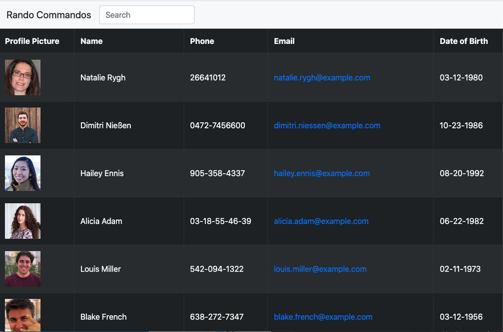
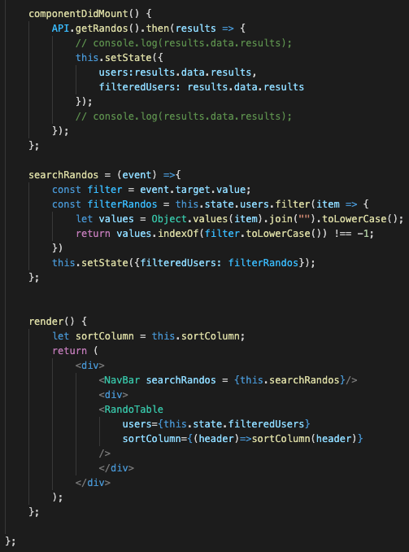

# employee-directory

## Deployes Link
- https://ryandelonhull.github.io/employee-directory/

## Description

Create an employee directoy with React that shows a table that i broken up into differnt js files. The 'name' column sorts the employees alphabetically and the search bar in the header finds employees names as well.

## Built With

- React
- Axios
- Bootstrap
- Javascript
- HTML

## Author 

### Ry Hull
 - https://github.com/ryandelonhull
 - https://linkedin.com/in/ryan-hull-94003144
 - https://ryandelonhull.github.io/Bootstrap-Portfolio/

 ## *Acknowledgments*

 Big thank you to Jerome, Kerwin, Manuel and my tutor for wading into the deep waters of coding with the class and keeping me afloat with their instruction and guidance. Thank you to my fellow classmates for including me in the study and homework sessions as working together on a problem has been a great teacher also.